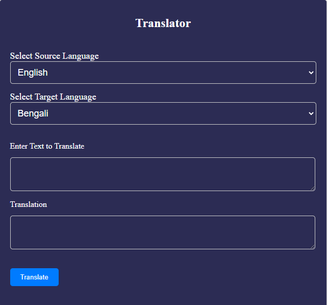

# Laguage translator same app using JavaScript, React  and Vue

This repository contains three separate applications for language translation implemented in JavaScript, React, and Vue. The language translation is powered by the Rapid API: Rapid Translate Multi Traduction.


## Rapid API Key Setup

Visit Rapid Translate Multi Traduction on RapidAPI.

Login to your RapidAPI account or sign up if you don't have one.

Then search translate-multi-traduction
or simple go to this link https://rapidapi.com/sibaridev/api/rapid-translate-multi-traduction/  then login and get api for making request.
## Installation Instructions

git clone https://github.com/KaziHasin/language-translator-javascript-react-vue.git

```bash
  cd language translator-react

  cd language-translator-vue
  
  npm install

  npm run dev
```
If you go with vanilla Javascript, then open the index.html file in your favorite browser from the language-translator-javascript project.

## Note
Make sure your api key set in the.env file in the react and vue apps and the script.js file apiKey variable for each app are working properly.


## 🚀 About Me
I'm a full-stack developer with 3 years of experience.


## follow my blog 
https://missionaryzeal.com/

## Authors

- [@octokatherine](https://www.github.com/KaziHasin)




